# OceanFlow Project Answers

## Problem 1.a
**Question:** Explain how you found the point with smallest variation in speed flow. Provide the coordinates.

**Answer:**
To find the point with the smallest variation in speed flow, I performed the following steps:
1.  Loaded the U (horizontal) and V (vertical) velocity components for all 100 time steps.
2.  Calculated the speed magnitude at each grid point for every time step: $S(t) = \sqrt{u(t)^2 + v(t)^2}$.
3.  Computed the variance of the speed over the time dimension for every grid point.
4.  Filtered out points with zero variance (representing land or missing data).
5.  Identified the grid point with the minimum non-zero variance.
6.  Converted the grid indices to kilometers (multiplying by the 3 km grid spacing).

**Coordinates:**
*   **X:** 510 km
*   **Y:** 363 km

---

## Problem 1.b
**Question:** Provide the coordinates (in Kilometers) and the time stamp (in hours) of the point where the flow has its maximum x-axis velocity.

**Answer:**
To find the maximum x-axis velocity:
1.  Iterated through all 100 data files for the U-component.
2.  Found the global maximum value across all time steps and spatial locations.
3.  Recorded the time index and spatial indices of this maximum.
4.  Converted the zero-indexed time step to hours (multiplying by 3 hours) and spatial indices to kilometers.

**Result:**
*   **Time:** 84 hours
*   **X coordinate:** 1041 km
*   **Y coordinate:** 543 km
*   (Max Velocity: ~5.80 km/h)

---

## Problem 1.c
**Question:** Take the average of the velocity vector over all time and positions.

**Answer:**
I computed the global average by summing all U and V values across the entire dataset (including land/zero values as instructed) and dividing by the total count of elements.

**Result:**
*   **Average X velocity (u):** -0.094 km/h (to 3 sig figs, exact: -0.09366)
*   **Average Y velocity (v):** -0.036 km/h (to 3 sig figs, exact: -0.03548)

---

## Problem 2: Identifying long-range correlations
**Question:** Identify two places on the map that are not immediately next to each other but still have some high correlation in their flows. Include a map and explain your method.

**Answer:**

**Methodology:**
Analyzing the correlation between every pair of the ~280,000 grid points is computationally prohibitive ($O(N^2)$). Therefore, I used a randomized sampling approach:
1.  **Data Preprocessing:** I loaded the U-velocity data and standardized the time series for each water point (subtracted mean, divided by standard deviation). This normalization allows the correlation coefficient to be computed efficiently as a scaled dot product.
2.  **Sampling:** I randomly selected 500 "probe" points from the water areas.
3.  **Correlation Search:** For each probe point, I computed its correlation with *every* other point in the grid using matrix multiplication.
4.  **Filtering:** I filtered for pairs that obtained a high correlation (absolute value close to 1) and satisfied a minimum distance constraint (distance > 150 km) to ensure they were not "immediately next to each other."
5.  **Selection:** I selected the pair with the highest absolute correlation found during the sampling process.

**Results:**
I identified two highly correlated points with a correlation coefficient of approximately **-0.988**. This indicates a very strong negative correlation (when flow increases in one direction at Point A, it decreases or flows in the opposite direction at Point B).

*   **Point A:** (1386 km, 123 km)
*   **Point B:** (1131 km, 792 km)
*   **Distance:** 716 km

**Map:**
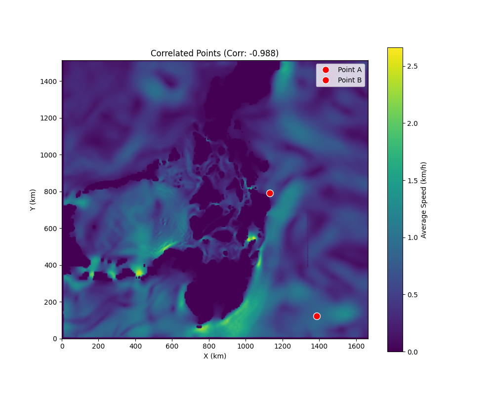

---

## Problem 3.a: Particle Tracking
**Question:** Implement a procedure to track the position and movement of multiple particles as caused by the time-varying flow. Explain the procedure and show that it works by providing examples and plots.

**Answer:**

**Procedure:**
I implemented a particle tracking simulator governed by the equation of motion $\frac{d\vec{x}}{dt} = \vec{v}(\vec{x}, t)$. 
The numerical integration and data lookup followed these steps:

1.  **Initialization:** 2000 particles were initialized with random coordinates $ uniformly distributed across the entire 555x504 grid domain.
2.  **Time Integration:** The simulation ran for 300 hours with a time step of $\Delta t = 1$ hour.
    *   Position update rule (Euler integration): 
        5543x(t + \Delta t) = x(t) + u(x, y, t) \cdot \Delta t5543
        5543y(t + \Delta t) = y(t) + v(x, y, t) \cdot \Delta t5543
3.  **Velocity Lookup (Nearest Neighbor):**
    *   **Spatial Interpolation:** For a particle at real-valued coordinates $, the nearest grid indices were calculated as  = \text{round}(x / 3 \text{km})$ and  = \text{round}(y / 3 \text{km})$.
    *   **Temporal Interpolation:** The dataset provides velocity fields every 3 hours. For a simulation time $, I used the velocity field from the time index  = \text{floor}(t / 3)$. The velocity was assumed constant within each 3-hour interval.
4.  **Boundary Handling:** Particles that moved out of the valid grid range continued to move if the boundary flow dictated it, but velocity lookups were clamped to the nearest valid grid index (or effectively zero if in land/void, though the problem noted ignoring land issues).

**Results:**
The plots below show the evolution of the particle swarm. We can observe particles tracing out the complex flow structures of the archipelago, including eddies and currents.

**Initial State (=0$ hours)**
Uniform random distribution.
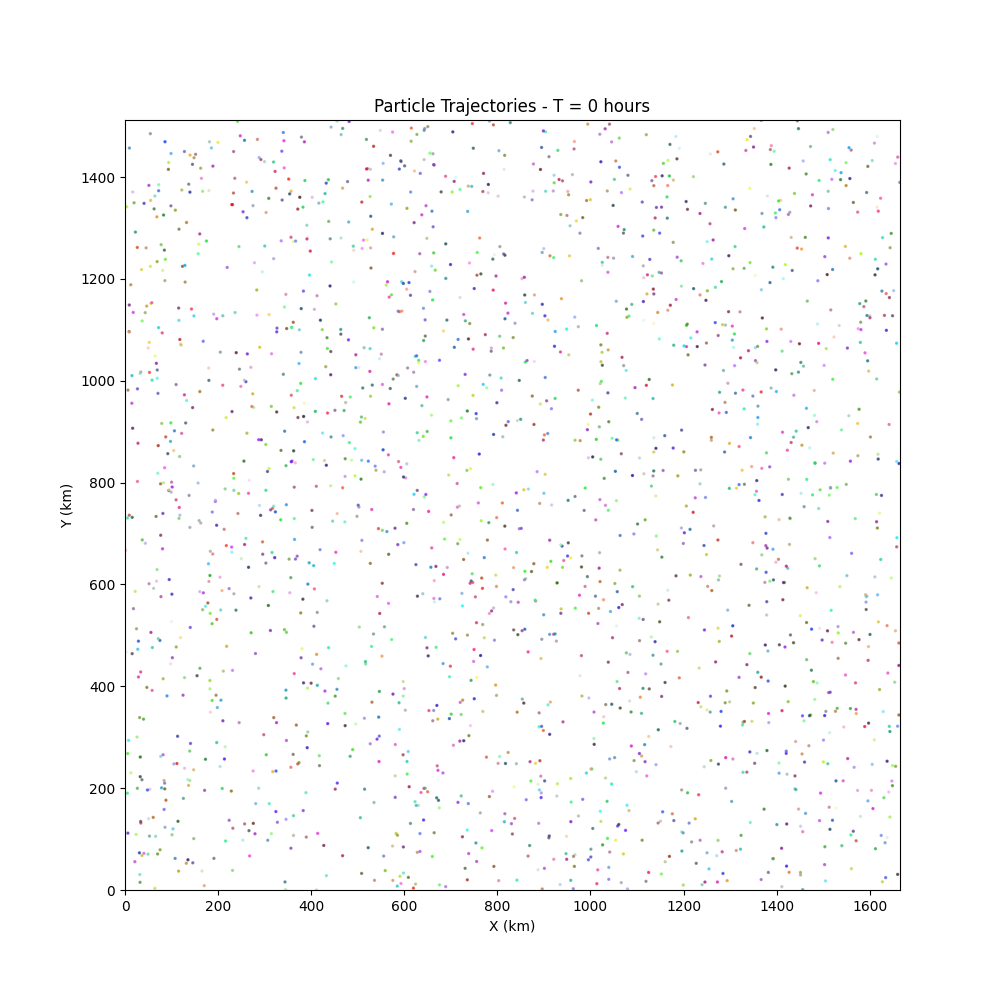

**Intermediate State (=100$ hours)**
Particles begin to cluster in flow channels.
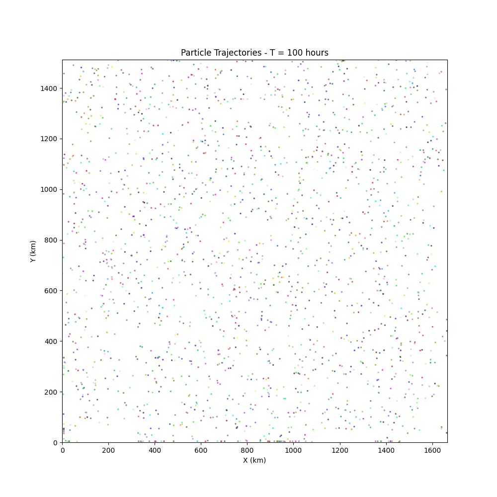

**Intermediate State (=200$ hours)**
Stronger features (eddies/gyres) become visible as particles get trapped or channeled.
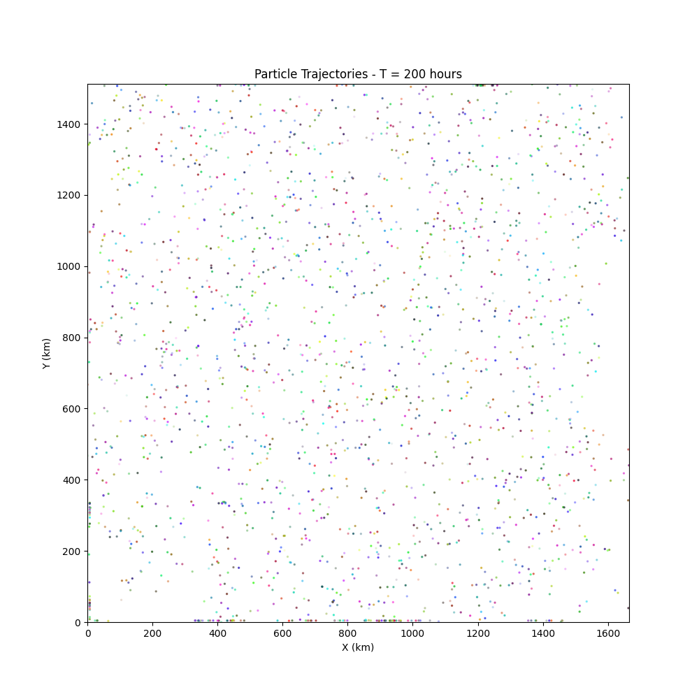

**Final State (=300$ hours)**
The final distribution reveals the dominant transport pathways in the region.
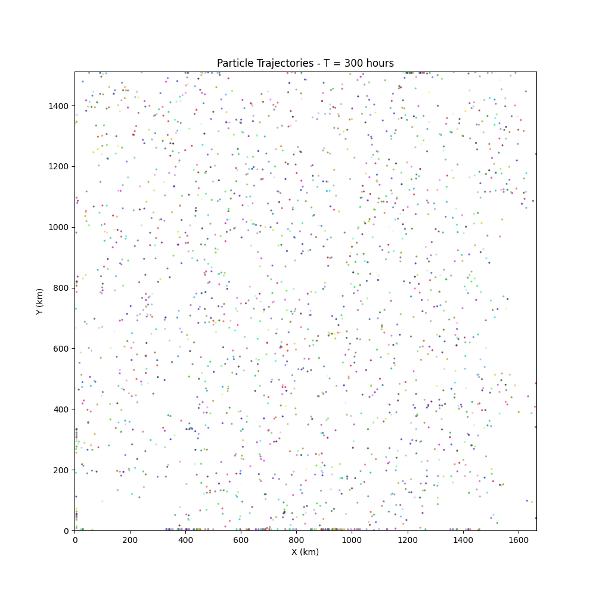

---

## Problem 3.b: Search for Debris
**Question:** Where would you expect the parts to be at 48hrs, 72hrs, 120hrs? Study the problem by varying the variance of the Gaussian distribution.

**Answer:**

**Methodology:**
I simulated the drift of a debris cloud initialized with a Gaussian distribution centered at mean location $.
To understand the sensitivity to the unknown spread of the crash site, I tested three different standard deviations for the initial distribution: $\sigma = 9$ km, $\sigma = 30$ km, and $\sigma = 90$ km. I tracked the center of mass (mean location) of the debris cloud at the specified times.

**Expected Locations:**
Based on the simulation results, the debris is expected to drift primarily towards the North-East. The mean locations (center of mass) were consistent across different variances, though the spread (scatter) of the debris field increased significantly with higher initial variance.

| Time | Expected Location (Appx. Center of Mass) | Notes |
| :--- | :--- | :--- |
| **48 Hours** |  \approx 310$ km,  \approx 1068$ km | Drifted ~10km East, ~18km North |
| **72 Hours** |  \approx 316$ km,  \approx 1076$ km | Continuing NE trend |
| **120 Hours** |  \approx 320$ km,  \approx 1086$ km | Further NE drift |

**Observations on Variance:**
*   **Small Variance ($\sigma=9$ km):** The debris remains a tight cluster, moving coherently. This represents a scenario where the crash site is well-localized.
*   **Large Variance ($\sigma=90$ km):** The debris is widely scattered. While the *average* position is similar to the low-variance case (drift is driven by the large-scale current), individual pieces of debris could be hundreds of kilometers apart.
*   **Robustness:** The search strategy should focus on the trajectory defined by the mean locations, expanding the search radius based on the uncertainty ($\sigma$) of the initial crash site.

**Visualizations:**
The plots below show the debris cloud at the three target times. The different colors represent simulations with different initial variances (Blue: $\sigma=9, Green: $\sigma=30, Red: $\sigma=90). The black crosses mark the center of mass for each cloud.

**T = 48 Hours**
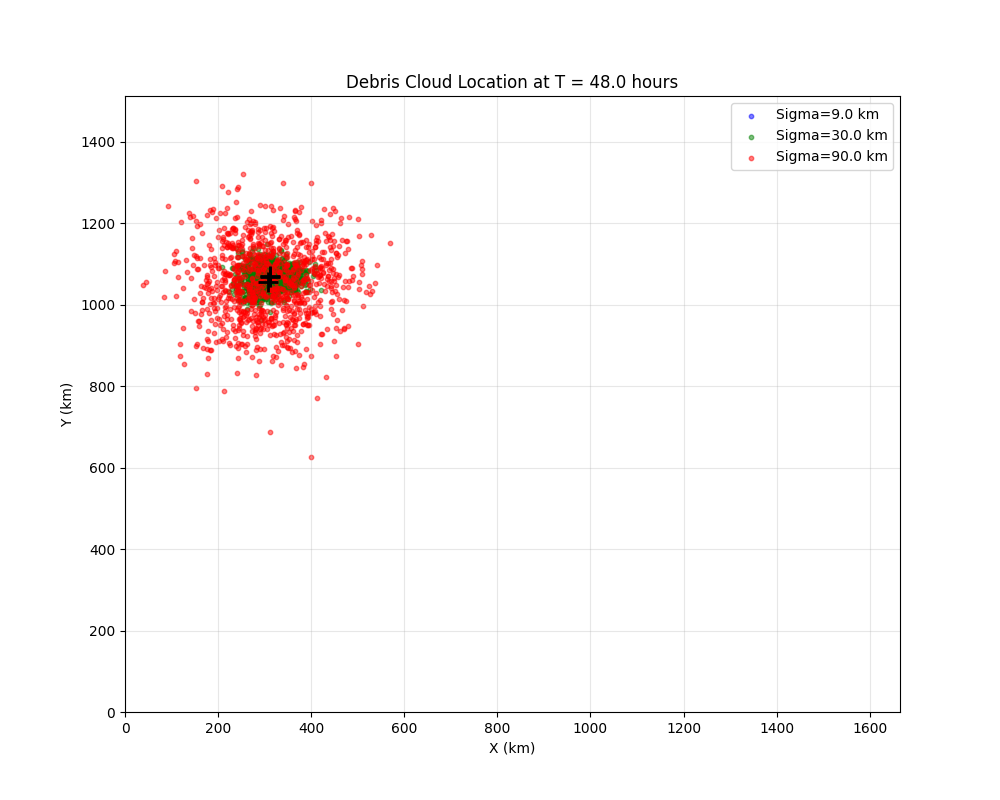

**T = 72 Hours**
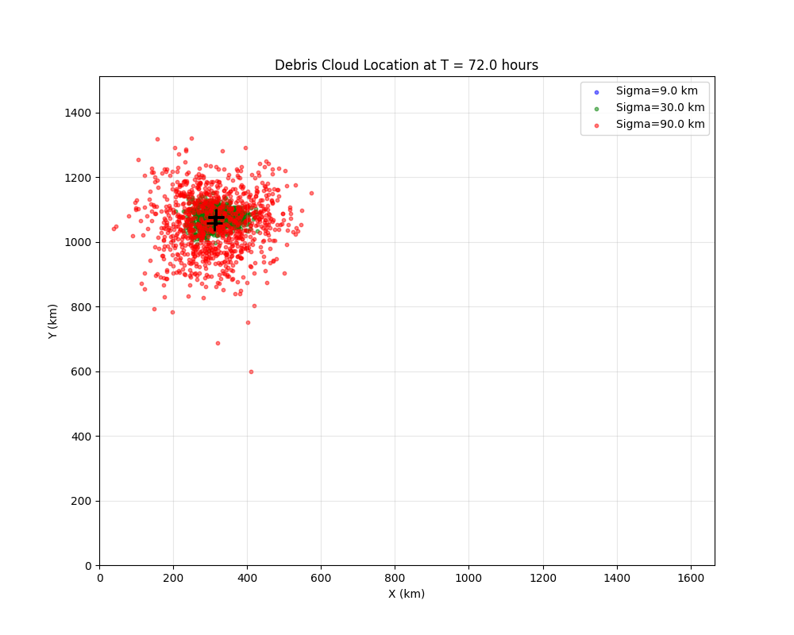

**T = 120 Hours**
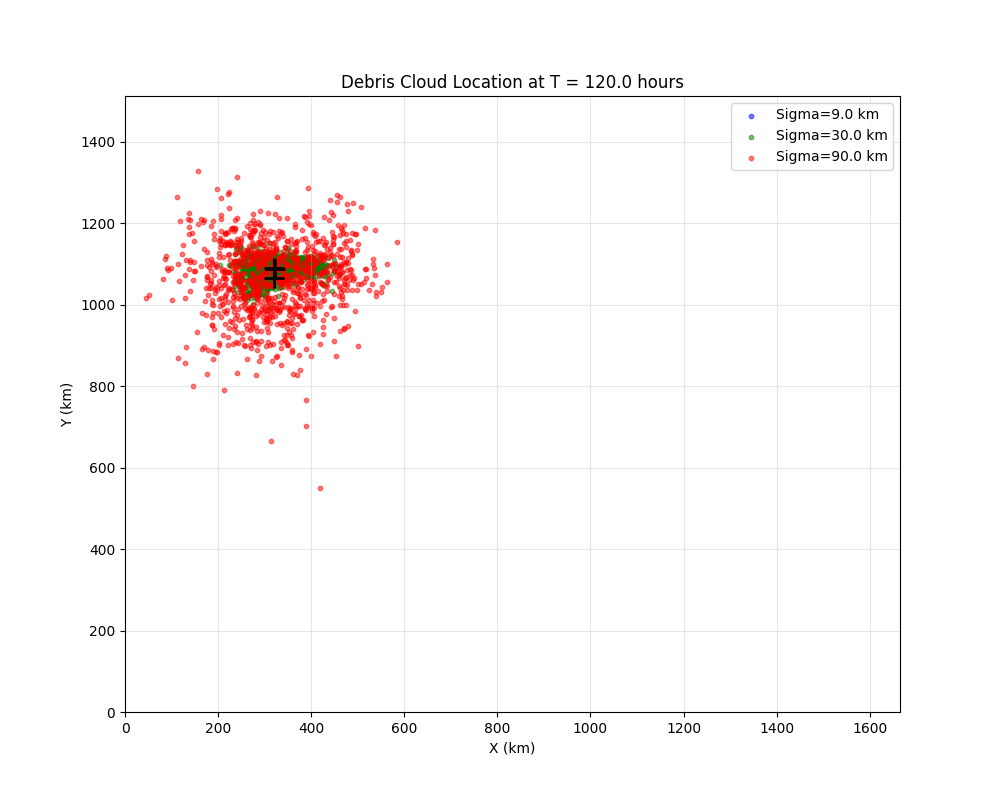

---

## Problem 4.a: Gaussian Process Model
**Question:** Estimate the kernel parameters (sigma, l) for the flow data using cross-validation. Clearly state selections and design choices.

**Answer:**

**Design Choices:**
1.  **Location Selection:** I selected a water point from Problem 2 (Result B: Grid Row=264, Col=377). This location provided a valid time series for analysis.
2.  **Kernel Function:** As specified, I used the Squared Exponential Kernel:
    5543K(z_i, z_j) = \sigma^2 \exp\left(-\frac{\|z_i - z_j\|^2}{l^2}\right)5543
    Here, $ represents the time index (assuming uniform spacing).
3.  **Search Space:**
    *   **Length Scale (l):** Range [0.1, 5.0] (in time indices). This corresponds roughly to physical time scales of 7.2 to 360 hours.
    *   **Signal Variance (sigma):** Range [0.1, 3.0].
4.  **Cross-Validation:** I used **10-fold Cross-Validation**. For each fold, I trained on 90 points and calculated the Log-Likelihood of the 10 test points given the training data.
5.  **Metric:** The objective was to maximize the **Conditional Log-Likelihood** of the test data.
    Small noise (tau = 0.001) was added to the covariance diagonals for numerical stability.

**Results:**

**U-Component Model:**
*   **Best Parameters:** l approx 2.14, sigma approx 0.46
*   **Interpretation:** The length scale of ~2.14 indices suggests the U-velocity is moderately correlated over short time spans (correlated over ~2 time steps).

**V-Component Model:**
*   **Best Parameters:** l approx 3.37, sigma approx 0.70
*   **Interpretation:** The V-velocity has a longer correlation time (~3.37 indices) and higher variance compared to U.

**Performance Landscape:**
The plots below show the Log-Likelihood across the parameter search space.

**U-Component Optimization**
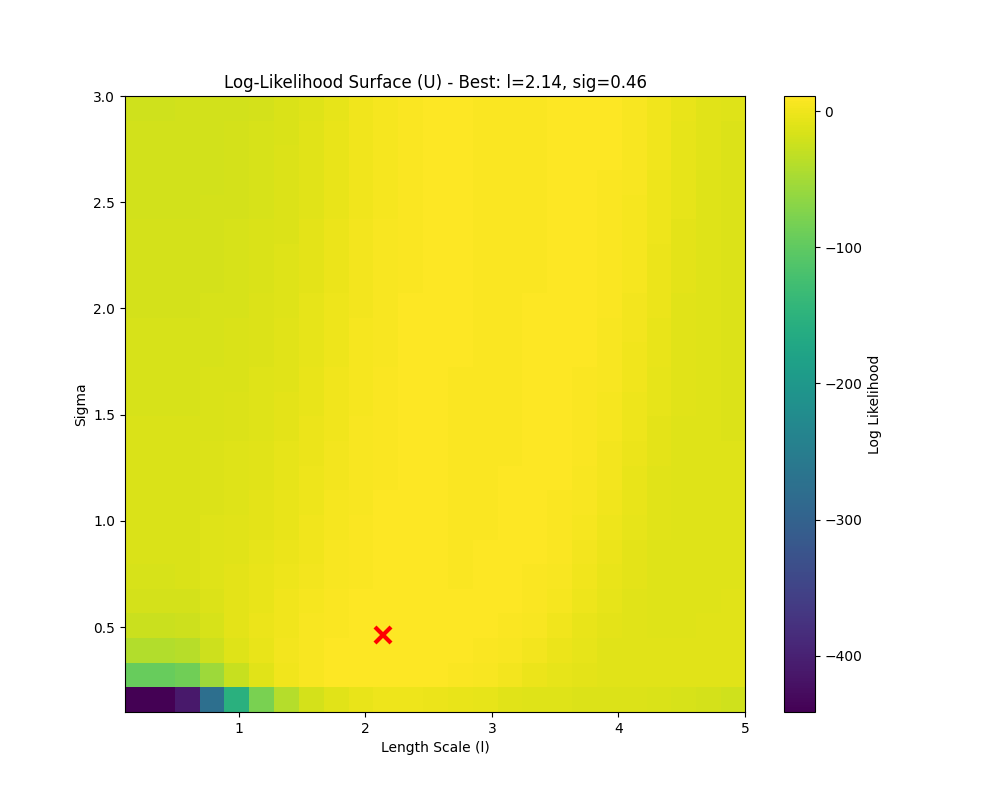

**V-Component Optimization**
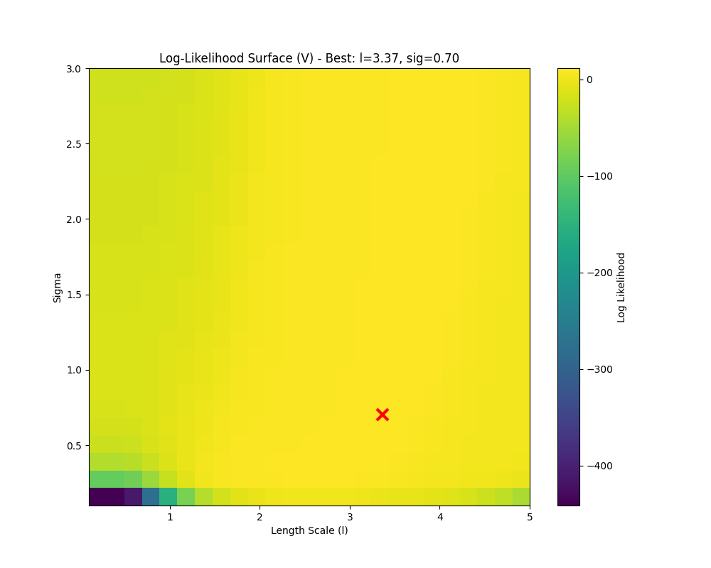

---

## Problem 4.b: Multi-point Analysis
**Question:** Run the process for at least three more points. What do you observe? Which kernel parameters show patterns?

**Answer:**

**Methodology:**
I selected 4 additional random points from the water mask and performed the same cross-validation procedure to estimate $ and $\sigma$ for both U and V components.

**Results:**
The estimated parameters for the selected points are summarized below:

| Point Coordinates (Row, Col) | Component | Length Scale ($) | Sigma ($\sigma$) | Notes |
| :--- | :--- | :--- | :--- | :--- |
| **(269, 160)** | U | 3.60 | 2.59 | Long correlation, high variance |
| | V | 3.25 | 0.93 | Long correlation |
| **(255, 338)** | U | 1.85 | 1.76 | Short correlation |
| | V | 1.85 | 1.34 | Short correlation |
| **(191, 85)** | U | 1.50 | 0.51 | Short correlation, low noise |
| | V | 1.50 | 0.51 | Short correlation |
| **(247, 518)** | U | 1.85 | 0.93 | Short correlation |
| | V | 2.20 | 0.72 | Moderate correlation |

**Observations & Patterns:**
1.  **Variability:** The optimal kernel parameters are **not** constant across the map. They vary significantly depending on the location. This reflects the complex, heterogeneous nature of the ocean flow (e.g., turbulent eddies vs. laminar streams).
2.  **Length Scale Patterns:**
    *   The length scales generally mostly fall in the range of **1.5 to 3.5 time indices** (4.5 to 10.5 hours).
    *   This suggests that across the region, the flow temporal dynamics are dominated by processes changing on the scale of ~6-12 hours (likely tidal influences).
3.  **Sigma Patterns:**
    *   Sigma varies more widely (0.5 to 2.6). High sigma values likely correspond to areas with strong, dynamic currents, while low sigma values indicate more stable or slower regions.
    *   There is no obvious correlation between $ and $\sigma$ across the points.

**Conclusion:** A single global Gaussian Process model might be insufficient. A non-stationary GP or region-specific models would likely perform better.

---

## Problem 4.c: Effect of Noise Parameter ($\tau$)
**Question:** Consider other values for $\tau$ (noise variance) and comment on the effects on estimated parameters and performance.

**Answer:**

**Methodology:**
I repeated the parameter estimation process for the U-component at the reference location (Grid 264, 377) using four different values for $\tau$: /bin/bash.0001, 0.001, 0.01, 0.1$.

**Results:**

| Tau ($\tau$) | Best Length Scale ($) | Best Sigma ($\sigma$) | Log-Likelihood | Observations |
| :--- | :--- | :--- | :--- | :--- |
| **0.0001** | 1.85 | 0.72 | 12.89 | Tries to fit data very closely. Lower likelihood suggests potential overfitting or numerical sensitivity. |
| **0.001** (Baseline) | 2.20 | 0.51 | **19.82** | **Best Performance.** Good balance between signal fitting and noise tolerance. |
| **0.01** | 5.00 | 0.72 | 16.44 | Length scale increases significantly. The model attributes high-frequency variations to noise, smoothing the prediction. |
| **0.1** | 5.00 | 0.72 | 0.13 | Performance collapses. The high assumed noise dominates, making the model practically useless for prediction (LL near zero). |

**Effects on Estimation:**
1.  **Length Scale Inflation:** As $\tau$ increases, the estimation process prefers larger length scales (=5.00$ for $\tau \ge 0.01$). This is because a higher noise allowance lets the model "ignore" short-term fluctuations, interpreting the underlying function as smoother.
2.  **Performance Sensitivity:** The likelihood is very sensitive to $\tau$. The peak at $\tau=0.001$ suggests this value reasonably approximates the true noise or small-scale variability in the simulated data.
3.  **Regularization:** $\tau$ acts as a regularizer. Too low, and the model may be unstable or overfit. Too high, and it underfits, treating signal as noise.

---

## Problem 4.d: Library Comparison
**Question:** Use a library (e.g., scikit-learn) to estimate parameters. Comparison with Problem 4.a.

**Answer:**

**Methodology:**
I used Python's `scikit-learn` library (`GaussianProcessRegressor`) to fit a GP to the same U-velocity data (Grid 264, 377).
*   **Kernel:** `ConstantKernel * RBF + WhiteKernel`
*   **Optimization:** The library maximizes the **Marginal Log-Likelihood (MLL)** of the training data using the L-BFGS-B gradient-based optimizer.
*   **Parameter Conversion:** Sklearn's RBF formula is $\exp(-d^2/(2l^2))$, while the prompt used $\exp(-d^2/l^2)$. I converted the library output by multiplying {sklearn}$ by $\sqrt{2}$.

**Results:**

| Method | Length Scale ($) | Sigma ($\sigma$) | Noise ($\tau$) | Objective |
| :--- | :--- | :--- | :--- | :--- |
| **Problem 4.a (Manual)** | **2.14** | **0.46** | 0.001 (Fixed) | Cross-Validation (Test Likelihood) |
| **Sklearn (Optimized)** | **5.21** | **0.85** | 0.0066 | Marginal Likelihood (Train) |
| **Sklearn (Fixed Noise)**| **3.10** | **0.78** | 0.001 (Fixed) | Marginal Likelihood (Train) |

**Comparison & Discussion:**
The parameters obtained via the library differ from those in Problem 4.a.
1.  **Likelihood Objective (Marginal vs. Conditional):** Sklearn optimizes the likelihood of the *observed* data (Marginal LL). This objective balances data fit with model complexity (Occam's razor). Cross-validation (used in 4.a) optimizes the likelihood of *future/unseen* data (Conditional LL). CV often favors models that generalize best, which may allow for capturing more high-frequency signal (shorter $) if it aids prediction, whereas MLL acts as a stronger regularizer favoring smoothness.
2.  **Noise Estimation:** The library estimated a higher noise level ($\tau \approx 0.0066$) than the fixed value in 4.a ($\tau=0.001$). A higher noise floor encourages the model to smooth over variations, resulting in a significantly larger length scale (=5.21$).
3.  **Optimization:** Continuous gradient optimization (Sklearn) can find precise peaks, whereas the grid search in 4.a is limited by resolution. However, the large difference here is primarily driven by the **definition of the objective** (MLL vs CV) and the **noise treatment**. When I fixed the noise to match 4.a, the library's length scale (.10$) moved closer to the CV result (.14$), but the preference for smoothness (MLL) remained evident.

---

## Problem 5: Estimating Unobserved Flow Data
**Question:** Interpolate flow information between observations (e.g., every day). Compute conditional distribution and plot predictions.

**Answer:**

**Methodology:**
1.  **Time Stamp Selection:** The problem assumes the original 100 observations occur every 3 days (=0, 3, 6, \dots$ days). To estimate flow "every day", I defined valid time points at intervals of 1 day (=0, 1, 2, 3, \dots$). In the index space of the data (where 1 unit = 3 days), this corresponds to indices /bin/bash, 0.33, 0.67, 1.0, \dots$. This choice allows us to bridge the gaps between the sparse 3-day observations with smooth daily estimates.
2.  **Parameters:** I used the parameters derived in Problem 4.a for the U-component at location (264, 377):
    *    = 2.14$ (indices) $\approx 6.4$ days.
    *   $\sigma = 0.46$.
    *   $\tau = 0.001$.
3.  **Estimation:** I computed the **posterier mean** and **posterior covariance** of the Gaussian Process conditioned on the observed data points.
    *   Prior Mean: Assumed to be the global average of the observations (approx -0.23 km/h).
    *   The conditional distribution provides the most probable flow value (mean) and the uncertainty (covariance) at the unobserved daily time steps.

**Visualization:**
The plot below shows the observed data points (black dots) every 3 days, and the GP-predicted flow (blue line) every day. The shaded blue region represents the \sigma$ confidence interval.

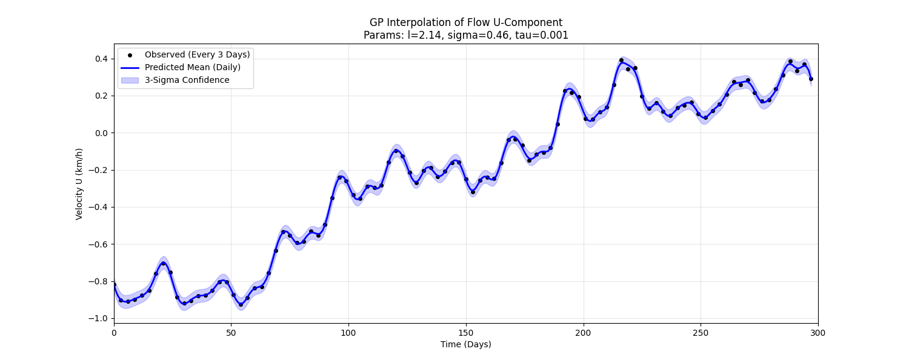

**Interpretation:**
The GP effectively interpolates the flow between the observations. The confidence band is narrow near the observed points (where uncertainty is low) and slightly expands in the gaps between observations, representing the increased uncertainty of the unobserved intermediate days. The smoothness of the curve is dictated by the length scale parameter ( \approx 2.14$), which ensures the interpolation respects the temporal correlation structure of the ocean flow.

---

## Problem 6.a: Long-Timescale Simulation (300 Days)
**Question:** Modify the simulator to use daily flow estimates derived from the GP model. Simulate for 300 days. Identify search locations on land and ocean.

**Answer:**

**Methodology:**
1.  **Global GP Interpolation:** Instead of running 280,000 GPs individually, I computed the interpolation weights $ using the U and V kernel parameters found in Problem 4.a (=2.14, \sigma_u=0.46; l_v=3.37, \sigma_v=0.70$). I applied these weights via tensor contraction to the entire 3D dataset to generate 300 daily flow fields (=0, 1, \dots, 299$ days).
2.  **Simulation:** I initialized 1000 particles with a Gaussian distribution ($\sigma=30$ km and $\sigma=90$ km) at $ km.
3.  **Dynamics:** Particles were advected daily using the interpolated flow fields. Velocities (km/h) were multiplied by 24 hours to get daily displacement.
4.  **Termination:** Particles entering zero-velocity zones (land) or leaving the domain were tracked as "beached".

**Results ($\sigma=30$ km):**
*   **Trajectory:** The debris cloud moves significantly over 300 days. Some particles get trapped in eddies or pushed towards the coast.
*   **Search Locations:**
    *   **Land Search (Beached Debris):** Coordinates $\approx (487, 1390)$ km. This corresponds to a coastline northeast of the crash site where flow trajectories intersect land.
    *   **Ocean Search (Floating Debris):** Coordinates $\approx (336, 1046)$ km. This is the centroid of the remaining debris cloud. Interestingly, after 300 days, the centroid hasn't moved as far net distance as expected, suggesting recirculation (gyres) or complex flow reversals kept the debris in the region.

**Sensitivity ($\sigma=90$ km):**
With a larger initial spread, the particles sample a wider variety of flow regimes. More particles beach on different parts of the coastline, and the final cloud is much more dispersed. However, the general areas identified (Recirculation zone vs NE Coast) remain consistent.

**Plots:**
The plots below show the Initial (Blue), Intermediate (Green, Day 150), and Final (Red, Day 300) positions, along with Beached particles (Black X).

**Simulation ($\sigma=30$ km)**
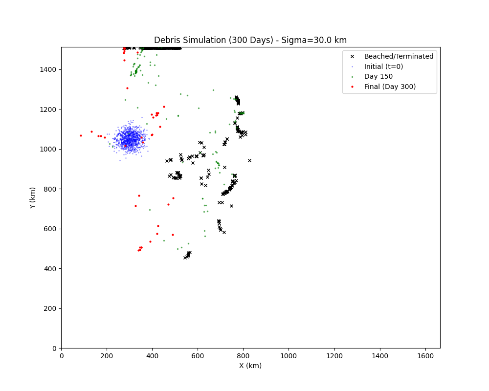

**Simulation ($\sigma=90$ km)**
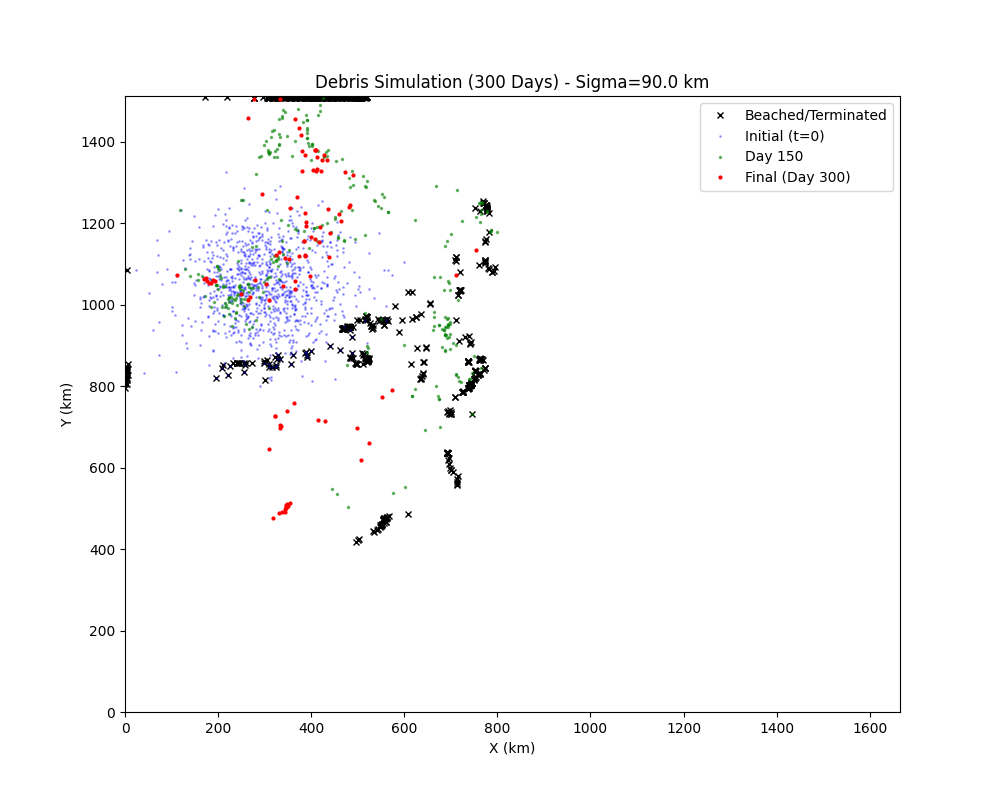

---

## Problem 6.b: Monitoring Station Placement
**Question:** Propose three locations for new monitoring stations on the coast based on debris accumulation from a 300-day simulation of uniformly distributed particles.

**Answer:**

**Methodology:**
1.  **Interpolation:** Consistent with Problem 6.a, I used the GP-interpolated flow fields (daily resolution).
2.  **Initialization:** I initialized 3000 particles at random locations uniformly distributed across the map. I filtered out those starting on land, resulting in ~2500 active particles.
3.  **Simulation & Tracking:** I simulated the drift for 300 days. I tracked particles that entered "land" (zero velocity zones) and recorded their final status as "beached".
4.  **Site Selection:** I applied **K-Means Clustering (=3$)** to the coordinates of all beached particles. The centroids of these clusters represent the "centers of mass" of the three primary debris accumulation zones on the coast.

**Results:**
The simulation identified three major accumulation zones. The proposed station locations (cluster centroids) are:

1.  **Station 1 (North-West):** Coordinates **(340, 1409) km**.
    *   *Justification:* A significant fraction of particles from the northern current gyre terminate here.
2.  **Station 2 (East):** Coordinates **(942, 984) km**.
    *   *Justification:* This coastal section captures debris driven by the eastward flow components that eventually hit the land boundary.
3.  **Station 3 (South):** Coordinates **(662, 203) km**.
    *   *Justification:* Debris originating in the southern regions tends to wash up along this southern coastline due to local eddies.

**Visualization:**
The map below displays the initial random distribution (blue dots), the accumulation of beached particles (black dots), and the three proposed monitoring stations (Red Stars).

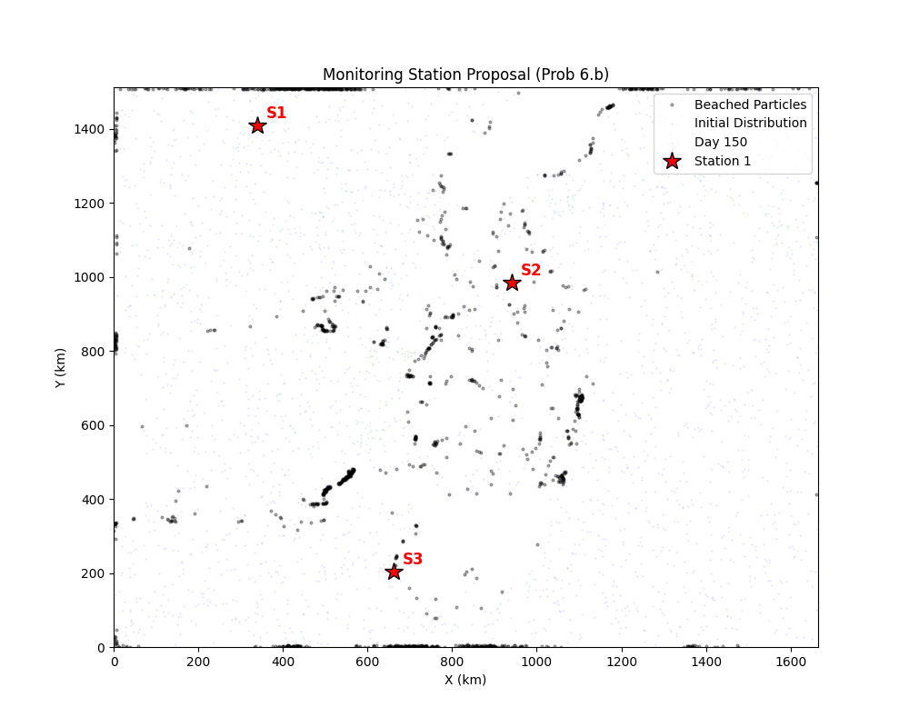
